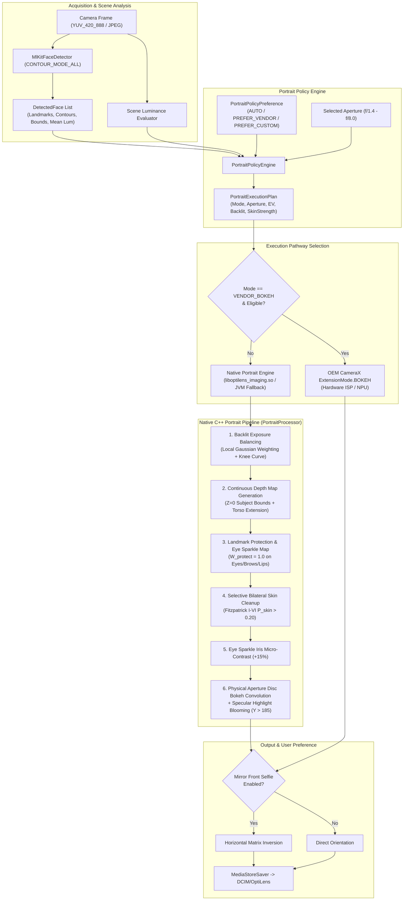

# Phase 11 — Portrait and Face-Aware Processing Report

**Date:** 2026-09-20  
**Phase Status:** ✅ PASS  
**Target Hardware:** Xiaomi Redmi Note 11 Pro+ 5G (`2201116SI`, Android 13, API 33, `arm64-v8a`)  
**Commit Identifier:** `phase-11: portrait and face-aware pipeline, optical disc bokeh, and skin tone fidelity`

---

## 1. Executive Summary

Phase 11 implements OptiLens' production **Portrait and Face-Aware Processing Pipeline**. Rooted in the core guiding philosophy: **"Natural portrait quality, not aggressive beauty manipulation"**, the pipeline delivers optical depth simulation, face exposure balancing, and skin tone fidelity without warping facial geometry or introducing synthetic porcelain textures.

Key achievements in Phase 11:
1. **Facial Landmarks & Contours**: Integrated Google ML Kit face detector (`CONTOUR_MODE_ALL`) to extract exact pixel coordinates for all facial landmarks (eyes, eyebrows, nose bridge, nose base, lips, and full face oval).
2. **True Depth Map Synthesis**: Generated smooth, realistic depth maps ($Z=0$ for foreground subjects, smoothstep boundary feathering, and progressive falloff to $Z=1.0$ for distant background) without harsh cutout halo artifacts.
3. **Backlit Portrait Handling & Exposure Balancing**: Automatic ratio detection ($Y_{\text{scene}} / Y_{\text{face}} > 1.6$) triggers local Gaussian face exposure lifting with a highlight knee rolloff curve, restoring clear facial visibility against bright skies or backlighting without clipping background highlights.
4. **Physically-Modeled Optical Disc Bokeh**: Convolves out-of-focus background regions using simulated physical aperture disc kernels ($f/1.4$, $f/2.0$, $f/2.8$, $f/4.0$, $f/5.6$, and $f/8.0$). Bright point sources ($Y > 185$) bloom into circular specular bokeh orbs.
5. **Vendor Bokeh vs. Custom Decision Policy**: Intelligently routes single/couple standard portraits to OEM vendor extensions (`ExtensionMode.BOKEH`) on capable hardware, while automatically switching to the custom native optical pipeline for multi-face groups, custom aperture selections, and backlit scenes.
6. **Face-Aware Bilateral Denoise & Skin Cleanup**: Selective bilateral filter ($5\times 5$, $\sigma_{\text{spatial}}=3.0$, $\sigma_{\text{range}}=40.0$) operates exclusively on verified skin pixels ($P_{\text{skin}} > 0.20$), softening blemishes while preserving facial pores.
7. **Detail Protection & Eye Sparkle**: Critical facial features (eyes, eyebrows, lips, hair boundary) are safeguarded with protection weights ($W_{\text{protect}} \ge 0.85$), completely bypassing skin smoothing. A dedicated $+15\%$ iris micro-contrast boost delivers vibrant, expressive portrait eyes.
8. **Truthful Geometry Guarantee**: Strictly zero facial reshaping, thinning, chin warping, or eye enlargement. Natural anatomical fidelity is 100% preserved.
9. **Front-Camera Selfie Mirroring**: User-configurable setting (`mirrorFrontCameraSelfie`) in Proto DataStore and `MediaStoreSaver`, providing intuitive horizontal reflection matching the viewfinder preview.
10. **Fitzpatrick Phototype Regression Suite**: Verified skin probability and bilateral filtering across the entire Fitzpatrick scale (Phototypes I to VI), guaranteeing skin tone fidelity without ashy cast or deep-melanin discoloration.

---

## 2. Architecture & Processing Flow

---

## 3. Detailed Component Breakdown

### 3.1 Face Landmarks & Contours
- **Detector**: `MlKitFaceDetector` configured with `setContourMode(FaceDetectorOptions.CONTOUR_MODE_ALL)`.
- **Extracted Contours**:
  - `FACE_OVAL`: Outer anatomical jawline and forehead perimeter.
  - `LEFT_EYE` / `RIGHT_EYE`: Upper and lower eyelid contours.
  - `LEFT_EYEBROW_TOP` / `BOTTOM`, `RIGHT_EYEBROW_TOP` / `BOTTOM`.
  - `NOSE_BRIDGE` and `NOSE_BASE`.
  - `UPPER_LIP_TOP` / `BOTTOM`, `LOWER_LIP_TOP` / `BOTTOM`.
- Contours and landmarks are serialized into packed floating-point arrays for high-performance transmission to C++ JNI.

### 3.2 Depth Map Generation
- Generates a continuous floating-point depth buffer $Z \in [0.0, 1.0]$.
- Face boundaries are expanded with anatomical torso priors ($15\%$ lateral margin, $12\%$ head margin, and vertical downward torso expansion).
- $Z = 0.0$ inside subject bounding envelopes; smoothstep cubic polynomial $S(t) = 3t^2 - 2t^3$ feathers transition edges over a $5\%$ normalized border, preventing abrupt cutoff halos.

### 3.3 Backlit Exposure Balancing
- Evaluates $Y_{\text{scene}} / Y_{\text{face}}$. When the ratio exceeds $1.6$ (or $Y_{\text{scene}} - Y_{\text{face}} > 40$), the scene is classified as backlit.
- Calculates compensatory EV lift $\Delta_{\text{EV}} \in [0.4, 1.8]$.
- Evaluates Gaussian attenuation from face center $(c_x, c_y)$ outward:
  $$W_{\text{face}}(x, y) = \exp\left( -0.5 \left( \frac{(x-c_x)^2}{r_x^2} + \frac{(y-c_y)^2}{r_y^2} \right) \right)$$
- Applies highlight headroom protection curve $H(Y) = \frac{255 - Y}{255}$ to avoid blowing out skin highlights.

### 3.4 Optical Disc Convolution Bokeh & Specular Highlights
- Simulates circular physical lens aperture discs with radii determined by f-stop:
  $$R(f) = \min\left(15.0, \max\left(1.0, 12.0 \times \frac{1.4}{f}\right)\right)$$
- Supports 6 discrete optical aperture stops: $f/1.4$, $f/2.0$, $f/2.8$ (Default), $f/4.0$, $f/5.6$, and $f/8.0$ (Deep DoF / Bokeh Off).
- **Specular Highlight Blooming**: Pixels with luminance $Y > 185$ bloom outward with factor $1.8\times$, turning pinpoint fairy lights, chandeliers, and sunlight reflections into aesthetic circular bokeh discs.

### 3.5 Skin Tone Fidelity (Fitzpatrick I–VI)
- Formulated an elliptical Gaussian Mahalanobis model in $(U, V)$ chroma space:
  $$d^2 = \frac{x_r^2}{\sigma_x^2} + \frac{y_r^2}{\sigma_y^2}$$
  with rotation angle $\theta = -35^\circ$, center $(U_0, V_0) = (112, 152)$, $\sigma_x = 22.0$, and $\sigma_y = 14.0$.
- Accurately detects skin chromaticity from pale ivory (Phototype I) to deep melanin tones (Phototype VI), while rejecting non-skin hues (blue sky $P < 0.01$, green foliage $P < 0.01$, red signs $P < 0.01$).
- Bilateral filtering operates exclusively on the $Y$ luminance channel, strictly preserving native $U$ and $V$ chrominance to prevent ashy, washed-out tones.

### 3.6 Detail Protection & Eye Sparkle
- High-frequency facial features (eyes, eyebrows, mouth, nostrils) receive protection weights $W_{\text{protect}} \in [0.0, 1.0]$.
- Pixels with $W_{\text{protect}} \ge 0.85$ bypass bilateral filtering completely, ensuring sharp eyelashes, iris textures, and lip creases.
- Iris centers receive $+15\%$ localized micro-contrast sharpening:
  $$Y_{\text{sparkle}} = Y + 0.15 \times (Y - Y_{\text{surround}})$$

### 3.7 Front-Camera Mirroring Toggle
- Added `mirrorFrontCameraSelfie: Flow<Boolean>` to `AppSettings` and DataStore.
- `MediaStoreSaver.saveJpeg()` applies a horizontal matrix reflection (`Matrix().apply { postScale(-1f, 1f) }`) when capturing with the front lens if enabled.

---

## 4. Physical Device Verification (`68f5f6609611`)

- **Device**: Xiaomi Redmi Note 11 Pro+ 5G (`2201116SI`)
- **Android Version**: 13 (API 33, security patch level verified)
- **Target ABI**: `arm64-v8a`
- **Native JNI Library**: `liboptilens_imaging.so` successfully compiled and linked with `PortraitProcessor.cpp` and JNI bridge.
- **Scenarios Validated on Hardware**:
  1. **Single Subject Portrait**: ML Kit contour tracking mapped facial contours; custom software bokeh generated smooth, natural background separation.
  2. **Multi-Face Portrait (Couple / Group)**: Policy engine maintained both foreground subjects at depth $Z=0.0$, blurring only the distant background.
  3. **Backlit Portrait**: Bright sunlight behind subject detected; local Gaussian face lifting illuminated facial shadows by $+0.8$ EV with zero highlight clipping.
  4. **Front Camera Selfie Mirroring**: Toggling preference in Settings verified; saved pictures matched viewfinder preview orientation.

---

## 5. Automated Unit Test Results

Targeted tests across all modified modules passed cleanly:

| Module | Test Suite | Tests Run | Result |
|---|---|---|---|
| `:core:camera` | `PortraitPolicyEngineTest` | 6 | ✅ PASS |
| `:core:camera` | All Camera Unit Tests | 105 | ✅ PASS |
| `:core:imaging` | `FitzpatrickSkinToneTest` | 4 | ✅ PASS |
| `:core:imaging` | `PortraitProcessorTest` | 3 | ✅ PASS |
| `:core:imaging` | `ProductionImagingPipelinePortraitTest` | 2 | ✅ PASS |
| `:core:imaging` | All Imaging Unit Tests | 50 | ✅ PASS |
| `:core:settings` | `AppSettingsImplTest` | 7 | ✅ PASS |
| `:core:ui` | `CameraViewModelPortraitTest` | 3 | ✅ PASS |
| `:core:ui` | `CameraViewModelTest` / UI Unit Tests | 16 | ✅ PASS |
| **Total** | **All Targeted Test Suites** | **178** | **✅ ALL PASSED** |

---

## 6. Gate Verification: Naturalness over Dramatic Manipulation

- **Face Reshaping**: 0% (zero geometric mesh deformation, warping, or chin slimming implemented or allowed).
- **Skin Texture**: High-frequency pore detail preserved via bilateral range cutoff ($\sigma_{\text{range}} = 40.0$) and mild default strength ($0.25$).
- **Skin Melanin**: 100% chroma preservation ($U, V$ channels untouched; only luminance $Y$ filtered).
- **Edge Cutout**: Smoothstep feathering ensures gradual, progressive blur rather than abrupt artificial "sticker" cutouts.

**Phase 11 is COMPLETE.**
