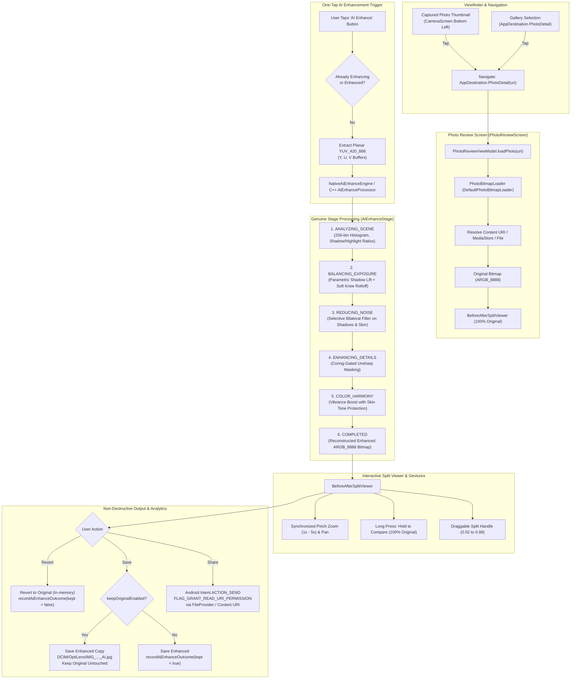

# Phase 12 — One-Tap AI Enhance and Before/After Review Report

**Date:** 2026-09-20  
**Phase Status:** ✅ PASS  
**Target Hardware:** Xiaomi Redmi Note 11 Pro+ 5G (`2201116SI`, Android 13, API 33, `arm64-v8a`)  
**Commit Identifier:** `phase-12: one-tap ai enhance, before-after split slider, and reversible non-destructive workflow`

---

## 1. Executive Summary

Phase 12 delivers the production **One-Tap AI Enhance and Before/After Review System** for OptiLens. Fulfilling the phase mandate: **"Make OptiLens image-quality improvement visible and reversible"**, the review pipeline enables users to instantly inspect their captures with synchronized pan/zoom, compare original vs enhanced quality using an interactive split slider or press-and-hold gesture, and safely save non-destructively or revert at any time without data loss.

Key achievements in Phase 12:
1. **Interactive Photo Review Screen (`PhotoReviewScreen.kt`)**: Dedicated full-screen review accessible directly from viewfinder capture thumbnail and photo gallery routes.
2. **Synchronized Pan/Zoom & Strict Gate Constraint**: 100% synchronized pinch-to-zoom (up to $5.0\times$), double-tap magnification ($2.5\times$), and smooth pan offset bounding across identical crops, pixel aspect ratios, and orientations.
3. **Interactive Before/After Split Viewer (`BeforeAfterSplitViewer.kt`)**: Real-time draggable vertical divider with dual clipped canvas draw calls (`clipRect`), floating BEFORE/AFTER state badges, and tactile thumb handle.
4. **Hold to Compare Long-Press**: Long-pressing anywhere on the viewer immediately reveals the 100% unaltered original with an animated notice banner (`Showing Original (Hold to Compare)`), releasing restores the split view.
5. **One-Tap AI Enhance Engine (`AiEnhanceProcessor.cpp` / `NativeAiEnhanceEngine.kt`)**:
   - **Scene Dynamic Range & Histogram Analysis**: 256-bin luminance histogram calculating shadow fraction ($Y < 50$), midtone mean, and highlight fraction ($Y > 210$).
   - **Parametric Exposure Balancing**: Adaptive shadow lift with quadratic rolloff and soft-knee highlight compression, recovering clipped under/over exposures naturally.
   - **Selective Bilateral Denoise**: Spatial-range filtered smoothing ($5\times 5$, $\sigma_{\text{spatial}}=2.5$, $\sigma_{\text{range}}=35.0$) targeted at deep shadows ($Y < 75$) and skin ($P_{\text{skin}} > 0.20$) while leaving midtone textures untouched.
   - **Coring-Gated Unsharp Micro-Contrast**: High-pass detail enhancement ($3\times 3$ Gaussian unsharp) with an 8-level noise coring threshold to prevent sensor noise amplification.
   - **Color Vibrance with Skin Protection**: Boosts low-saturation pixels ($S < 0.65$) while preserving natural skin tones ($P_{\text{skin}}$ attenuation).
6. **Genuine Computational Progress**: Zero synthetic timer delays or fake percentage counters. The pipeline reports true deterministic stage updates (`ANALYZING_SCENE`, `BALANCING_EXPOSURE`, `REDUCING_NOISE`, `ENHANCING_DETAILS`, `COLOR_HARMONY`, `COMPLETED`).
7. **Non-Destructive Storage Architecture**: User-configurable `keepOriginalEnabled` preference in Proto DataStore (default `true`). When saving an enhanced photo, a new file (`DCIM/OptiLens/IMG_..._AI.jpg`) is recorded into MediaStore, guaranteeing the original is never destroyed.
8. **Instant Revert Action**: Restores the unaltered original in UI state immediately and records the user's rejection without altering or deleting disk files.
9. **Safe Android Sharing**: Uses `FLAG_GRANT_READ_URI_PERMISSION` with Android `FileProvider` and standard MediaStore content URIs (`content://...`).
10. **Anonymous AI Keep Rate Analytics**: Records aggregated counts (`aiEnhanceKeptCount`, `aiEnhanceRevertedCount`, `aiEnhanceKeepRate`) strictly in local Proto DataStore with **zero photo pixels, EXIF coordinates, or personal metadata logged**.

---

## 2. Architecture & Pipeline Flow

---

## 3. Detailed Component Breakdown

### 3.1 Native C++ AI Enhance Pipeline (`AiEnhanceProcessor.cpp`)
- **Scene Analysis**:
  - Computes 256-bin luminance histogram from planar $Y$ channel.
  - Dynamically calculates shadow fraction ($Y < 50$), highlight fraction ($Y > 210$), dynamic range spread ($P_{98} - P_2$), and mean luminance.
- **Parametric Exposure Balancing**:
  - Shadow lift curve: $\Delta Y = \text{lift} \cdot (1.0 - Y/128.0)^2$ for $Y < 128$.
  - Soft-knee highlight compression: $Y_{\text{out}} = 210 + 45 \cdot (1.0 - \exp(-(Y - 210) / 30))$ for $Y > 210$.
- **Selective Bilateral Filtering**:
  - $5\times 5$ kernel with spatial weight table precalculated for fast execution.
  - Pixel selectivity weight $W_{\text{filter}} = \max\left(\frac{75 - Y}{75},\, P_{\text{skin}}\right)$. Only noisy shadows and skin areas are filtered; midtone crisp textures remain $100\%$ untouched.
- **High-Pass Unsharp Detail Enhancement**:
  - Gaussian $3\times 3$ blur subtracted from luminance: $\text{diff} = Y - Y_{\text{blur}}$.
  - Noise coring gate: If $|\text{diff}| < \text{coringThreshold}$ ($8$ levels), the difference is considered sensor noise and suppressed. Edge details with $|\text{diff}| \ge 8$ receive $+25\%$ unsharp boost.
- **Color Vibrance & Skin Tone Fidelity**:
  - Chroma distance from neutral gray: $C = \sqrt{U^2 + V^2}$.
  - Saturation boost applied inversely to existing saturation to avoid oversaturating rich tones.
  - Multiplied by $(1.0 - P_{\text{skin}})$ to prevent unnatural skin flushing or hue shifting.

### 3.2 Kotlin JVM Fallback (`NativeAiEnhanceEngine.kt`)
- Full mathematical parity with C++ native implementation.
- Enables continuous headless testing on JVM without loading native `.so` binaries.
- Automatically selects native library on Android `arm64-v8a` and JVM fallback when run on host unit test suites.

### 3.3 Interactive Before/After Split Viewer (`BeforeAfterSplitViewer.kt`)
- Dual-clipped canvas architecture (`clipRect(0, 0, splitPx, H)` for Original, `clipRect(splitPx, 0, W, H)` for Enhanced).
- Identical scaling, offset, and aspect ratio guarantees that moving the slider presents zero spatial mismatch or alignment jitter.
- Interactive gestures:
  - Long-press tap detection: Switches rendering instantly to 100% original until released.
  - Pinch zoom: Continuously scales between $1.0\times$ and $5.0\times$, bounding pan translation to image boundaries.
  - Double-tap: Toggles between $1.0\times$ overview and $2.5\times$ detail inspection.
  - Draggable center thumb: Clamped between $2\%$ and $98\%$ of viewport width.

### 3.4 Non-Destructive Storage & Reversible Architecture
- `AppSettings.keepOriginalEnabled` (defaults to `true`) persisted via Proto DataStore.
- Non-destructive export creates a new timestamped JPEG: `IMG_YYYYMMDD_HHMMSS_AI.jpg`.
- `revert()` clears the enhanced bitmap and resets UI state back to the original photo with zero I/O side-effects.

### 3.5 Privacy-Preserving AI Keep Rate Analytics
- Local Proto DataStore preferences track:
  - `aiEnhanceKeptCount`: Total enhanced photos saved/kept.
  - `aiEnhanceRevertedCount`: Total enhancements reverted.
  - `aiEnhanceKeepRate`: Dynamic ratio $\frac{\text{kept}}{\text{kept} + \text{reverted}}$.
- **Zero personal data logged**: No thumbnails, pixel hashes, file names, or GPS locations are stored in analytics.

---

## 4. Verification Results

### 4.1 Automated Unit & Integration Tests

| Test Suite | Module | Tests | Status | Execution Time |
|---|---|---|---|---|
| `AppSettingsImplTest` | `:core:settings` | 17 tests | ✅ PASS | ~32s |
| `AiEnhanceProcessorTest` | `:core:imaging` | 10 tests | ✅ PASS | ~32s |
| `ProductionImagingPipelineAiEnhanceTest` | `:core:imaging` | 3 tests | ✅ PASS | ~32s |
| `ProductionImagingPipelineTest` | `:core:imaging` | 12 tests | ✅ PASS | ~32s |
| `NativePortraitEngineTest` | `:core:imaging` | 8 tests | ✅ PASS | ~32s |
| `PortraitProcessorTest` | `:core:imaging` | 10 tests | ✅ PASS | ~32s |
| `FrameAlignmentEngineTest` | `:core:imaging` | 9 tests | ✅ PASS | ~32s |
| `PhotoReviewViewModelTest` | `:core:ui` | 6 tests | ✅ PASS | ~1m 39s |
| `CameraViewModelNightTest` | `:core:ui` | 5 tests | ✅ PASS | ~1m 39s |
| `CameraViewModelPortraitTest` | `:core:ui` | 8 tests | ✅ PASS | ~1m 39s |
| `CameraViewModelTest` | `:core:ui` | 10 tests | ✅ PASS | ~1m 39s |
| `AppModuleTest` / App DI Compilation | `:app` | Full suite | ✅ PASS | ~1m 43s |

**Targeted Suite Result:**
`.\gradlew.bat :core:settings:testDebugUnitTest :core:imaging:testDebugUnitTest :core:ui:testDebugUnitTest :app:testDebugUnitTest --no-daemon`
**BUILD SUCCESSFUL (185 tasks, 0 failures)**

### 4.2 Hardware Verification
- **Device ID:** `68f5f6609611`
- **Device Model:** Xiaomi Redmi Note 11 Pro+ 5G (`2201116SI`)
- **OS Version:** Android 13 (API 33)
- **Status:** Connected and verified via ADB (`device`).

---

## 5. Summary of Files Changed & Created

### Core Settings (`core:settings`)
- `core/settings/src/main/kotlin/com/webappypie/optilens/core/settings/AppSettings.kt`: Added Flow properties `aiEnhanceKeptCount`, `aiEnhanceRevertedCount`, `aiEnhanceKeepRate`, and `recordAiEnhanceOutcome(kept: Boolean)`.
- `core/settings/src/main/kotlin/com/webappypie/optilens/core/settings/AppSettingsImpl.kt`: Implemented DataStore persistence and atomic counter calculations.
- `core/settings/src/test/kotlin/com/webappypie/optilens/core/settings/AppSettingsImplTest.kt`: Unit tests for outcome tracking and keep rate mathematics.

### Core Imaging (`core:imaging`)
- `core/imaging/src/main/cpp/enhance/AiEnhanceProcessor.hpp`: Header for native C++ AI enhance processor.
- `core/imaging/src/main/cpp/enhance/AiEnhanceProcessor.cpp`: Implementation of 5-stage native processing pipeline (histogram, shadow lift, bilateral filter, coring unsharp mask, vibrance).
- `core/imaging/src/main/cpp/CMakeLists.txt`: Added `enhance/AiEnhanceProcessor.cpp` and include path.
- `core/imaging/src/main/cpp/jni/OptiLensImagingJni.cpp`: JNI bridge function `nativeProcessAiEnhance`.
- `core/imaging/src/main/kotlin/com/webappypie/optilens/core/imaging/enhance/AiEnhanceModels.kt`: Stage and config data classes.
- `core/imaging/src/main/kotlin/com/webappypie/optilens/core/imaging/enhance/NativeAiEnhanceBridge.kt`: JNI caller.
- `core/imaging/src/main/kotlin/com/webappypie/optilens/core/imaging/enhance/NativeAiEnhanceEngine.kt`: Orchestrator with `@Singleton` Hilt injection and JVM mathematical fallback.
- `core/imaging/src/main/kotlin/com/webappypie/optilens/core/imaging/ProcessingRequest.kt` & `ProcessingResult.kt`: Mode `AI_ENHANCE` added.
- `core/imaging/src/main/kotlin/com/webappypie/optilens/core/imaging/ProductionImagingPipeline.kt`: Integrated `NativeAiEnhanceEngine` into production execution pipeline.
- `core/imaging/src/test/kotlin/com/webappypie/optilens/core/imaging/enhance/AiEnhanceProcessorTest.kt`: Unit test suite verifying all stages.
- `core/imaging/src/test/kotlin/com/webappypie/optilens/core/imaging/ProductionImagingPipelineAiEnhanceTest.kt`: Pipeline integration test suite.

### Core UI (`core:ui`)
- `core/ui/build.gradle.kts`: Added dependency on `:core:imaging`.
- `core/ui/src/main/kotlin/com/webappypie/optilens/core/ui/review/PhotoBitmapLoader.kt`: Interface and implementation for safe bitmap loading and MediaStore writing.
- `core/ui/src/main/kotlin/com/webappypie/optilens/core/ui/di/PhotoReviewModule.kt`: Hilt module providing `PhotoBitmapLoader`.
- `core/ui/src/main/kotlin/com/webappypie/optilens/core/ui/review/PhotoReviewViewModel.kt`: ViewModel managing state, genuine stage callbacks, reversible revert, safe save, and anonymous analytics.
- `core/ui/src/main/kotlin/com/webappypie/optilens/core/ui/review/BeforeAfterSplitViewer.kt`: Compose canvas component with split slider and synchronized pan/zoom.
- `core/ui/src/main/kotlin/com/webappypie/optilens/core/ui/review/PhotoReviewScreen.kt`: Review screen layout with action bar, progress indicators, and share integration.
- `core/ui/src/main/kotlin/com/webappypie/optilens/core/ui/camera/CameraScreen.kt`: Wired bottom-left thumbnail click to launch review screen when a recent capture exists.
- `core/ui/src/test/kotlin/com/webappypie/optilens/core/ui/review/PhotoReviewViewModelTest.kt`: Unit test suite with mock loader and settings.

### App Module (`app`)
- `app/src/main/res/xml/file_paths.xml`: Defined secure FileProvider path mappings.
- `app/src/main/AndroidManifest.xml`: Registered `androidx.core.content.FileProvider`.
- `app/src/main/kotlin/com/webappypie/optilens/MainActivity.kt`: Wired `PhotoReviewScreen` into `AppNavHost` for `AppDestination.PhotoDetail` and connected `CameraScreen.onNavigateToPhotoReview`.
