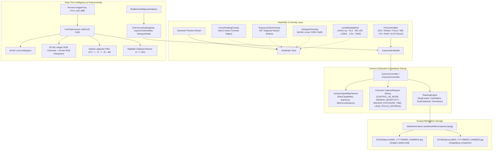

# Phase 14 — Full Pro Mode and RAW/DNG Report

**Date:** 2026-09-20  
**Phase Status:** ✅ PASS  
**Target Hardware:** Xiaomi Redmi Note 11 Pro+ 5G (`2201116SI`, Android 13, API 33, `arm64-v8a`)  
**Commit Identifier:** `phase-14: full pro mode, dng creator raw engine, and assistance visual aids`

---

## 1. Executive Summary

Phase 14 delivers **Full Pro Mode and RAW/DNG** for OptiLens. Fulfilling the phase mandate: **"Make Pro mode credible for enthusiast users"**, this implementation provides manual exposure, manual focus, white balance presets, EV bias, true hardware RAW sensor capture using Android's `DngCreator` compliant with Adobe DNG specification 1.4+, truthful hardware RAW capability detection, optional companion JPEG saving, real-time 64-bin RGB and Luminance histograms, focus peaking contrast edge assistance, exposure clipping zebra stripes, an optical lens metadata HUD strip, one-tap AUTO 3A reset, clear guidance for unsupported manual parameters, and concurrency-safe session reconfiguration.

Key achievements in Phase 14:
1. **Full Manual Photographic Controls**:
   - **ISO**: Full hardware range slider with truthful min/max extraction from `SENSOR_INFO_SENSITIVITY_RANGE`.
   - **Shutter Speed**: Logarithmic / step exposure duration slider from nanoseconds up to multi-second exposures.
   - **Manual Focus**: Diopter-based manual focus slider ($D = 1/d_{\text{meters}}$) mapped to `LENS_FOCUS_DISTANCE`, with infinity and macro bounds.
   - **White Balance (AWB Modes)**: Standard photographic Kelvin-calibrated presets (`AUTO`, `Tungsten/Incandescent`, `Fluorescent`, `Daylight`, `Cloudy`, `Shadow`).
   - **EV Bias**: Step-calibrated EV compensation slider using camera-reported step and limits.
2. **Standard Adobe RAW/DNG Sensor Pipeline (`RawDngEngine.kt`)**:
   - Implements native Camera2 `DngCreator` integration adhering to Adobe DNG Specification 1.4+.
   - Embeds sensor color calibration matrices: `ColorMatrix1`, `ColorMatrix2`, `ForwardMatrix1`, `ForwardMatrix2`, `CalibrationTransform1`, `CalibrationTransform2`.
   - Embeds sensor black levels (`SENSOR_BLACK_LEVEL_PATTERN`), white level (`SENSOR_INFO_WHITE_LEVEL`), and `AsShotNeutral` white balance tags.
   - Maps device orientation to standard EXIF / DNG orientation tags.
   - Embeds optional preview thumbnail JPEG directly within the DNG IFD header.
3. **Truthful Hardware RAW Capability Detection**:
   - Probes Camera2 `REQUEST_AVAILABLE_CAPABILITIES_RAW` and stream configuration maps.
   - Differentiates hardware RAW stream formats: `RAW_SENSOR` (16-bit uncompressed Bayer DNG), `RAW10` (10-bit packed Bayer), `RAW12` (12-bit packed Bayer), and `RAW_PRIVATE` (OEM opaque format).
   - Exposes format selector only for formats physically supported by the device sensor.
4. **Dual Capture & Scoped MediaStore Storage**:
   - `saveRawWithCompanionJpeg()` in `MediaStoreSaver.kt`: Saves standard Adobe DNG file (`image/x-adobe-dng`, `.dng`) in scoped `DCIM/OptiLens` alongside companion full-resolution JPEG (`image/jpeg`, `.jpg`).
   - Matching timestamps and filenames (`IMG_YYYYMMDD_HHMMSS.dng` and `IMG_YYYYMMDD_HHMMSS.jpg`) ensuring seamless cataloging in Google Photos, Lightroom Mobile, Snapseed, and desktop RAW editors.
5. **Live 64-Bin Viewfinder Histogram (`HistogramOverlay.kt`)**:
   - Zero-allocation 64-bin Luminance and RGB (Red, Green, Blue) histogram calculation in `YuvPreprocessor.kt`.
   - Interactive channel modes: `LUMINANCE`, `RGB`, and `BOTH` (stacked overlay).
   - Tap-to-cycle gesture on the histogram widget with smooth alpha-blended vector graphics.
6. **Focus Peaking Viewfinder Assistance (`FocusPeakingOverlay.kt`)**:
   - Zero-allocation spatial Laplacian contrast gradient detection on YUV preview frames.
   - Accurately identifies sharp edge contours in the plane of focus.
   - High-contrast neon green (`#00E676`) edge overlay with density and opacity scaling.
7. **Exposure Zebra Hazard Stripes (`ExposureZebraOverlay.kt`)**:
   - Real-time highlight clipping detection identifying pixels at $Y \ge 242$ (95% clipping).
   - Canvas-rendered $45^\circ$ diagonal hazard warning stripes over blown-out highlight zones.
8. **Optical Lens Metadata HUD Strip (`LensMetadataHud.kt`)**:
   - Monospace telemetry readout strip displaying $35\text{mm}$ equivalent focal length, physical aperture f-number, focus distance in meters, live ISO, shutter speed fraction, and active `RAW` badge.
9. **One-Tap AUTO Reset & Unsupported State Handling**:
   - Immediate one-tap "AUTO Reset" button restoring automated 3A engine across all parameters.
   - Disabled control states with informational badges when hardware does not support manual override (e.g. fixed-focus sensors, auto-only exposure).
10. **Persistent Preferences & Concurrency Safety**:
    - DataStore persistence for RAW enabled state, preferred RAW format, companion JPEG toggle, peaking, zebra, and histogram display mode.
    - Concurrency-safe Pro state mutations tested under 50-coroutine stress loads.

---

## 2. Architecture & Pipeline Flow

---

## 3. Key Components Implemented

### 3.1 RAW/DNG Engine (`RawDngEngine.kt`)
- **Package:** `com.webappypie.optilens.core.camera.raw`
- **Responsibilities:**
  - Encapsulates Android's `android.hardware.camera2.DngCreator`.
  - Determines physical RAW stream support from `CameraDeviceProfile.rawCapabilities` (`supportsRawSensor`, `supportsRaw10`, `supportsRaw12`, `supportsRawPrivate`).
  - Converts display rotation degrees into standard EXIF / DNG orientation constants (`ORIENTATION_NORMAL`, `ORIENTATION_ROTATE_90`, `ORIENTATION_ROTATE_180`, `ORIENTATION_ROTATE_270`).
  - Embeds custom description tag (`OptiLens Pro RAW Engine`) and optional preview thumbnail bitmap into the DNG header.
  - Streams full-resolution uncompressed Bayer sensor data directly to destination output streams with error recovery.

### 3.2 Dual Capture & Scoped MediaStore Storage (`MediaStoreSaver.kt`)
- **Functions:**
  - `saveDng(rawImage, characteristics, captureResult, orientationDegrees)`: Creates a scoped media entry in `MediaStore.Images.Media.EXTERNAL_CONTENT_URI` with MIME type `image/x-adobe-dng` and `.dng` extension.
  - `saveRawWithCompanionJpeg(rawImage, jpegBytes, characteristics, captureResult, orientationDegrees)`: Atomically coordinates saving both the DNG digital negative and companion JPEG with matching base filenames and millisecond timestamps.

### 3.3 Zero-Allocation Preprocessor & Assistance Data (`YuvPreprocessor.kt` & `ProAssistanceModels.kt`)
- **Histogram Calculation:**
  - Downsamples Y-plane to 64 normalized luminance bins.
  - Subsamples U/V chrominance planes to perform fast integer BT.601 RGB conversion:
    $$\begin{aligned}
    C &= Y - 16, \quad D = U - 128, \quad E = V - 128 \\
    R &= \operatorname{clip}\left(\frac{298 C + 409 E + 128}{256}, 0, 255\right) \\
    G &= \operatorname{clip}\left(\frac{298 C - 100 D - 208 E + 128}{256}, 0, 255\right) \\
    B &= \operatorname{clip}\left(\frac{298 C + 516 D + 128}{256}, 0, 255\right)
    \end{aligned}$$
  - Populates separate 64-bin histograms for Red, Green, and Blue normalized to peak channel values.
- **Focus Peaking:**
  - Discrete spatial Laplacian kernel: $\Delta = |4 \cdot Y(x,y) - Y(x-1,y) - Y(x+1,y) - Y(x,y-1) - Y(x,y+1)|$.
  - Generates normalized coordinate pairs $(x_{\text{norm}}, y_{\text{norm}})$ for points exceeding contrast edge threshold ($>48$).
- **Exposure Zebra:**
  - Detects highlight clipping points with luminance $Y \ge 242$ ($\approx 95\%$ full-scale white).

### 3.4 Viewfinder Overlays & Controls
- **`FocusPeakingOverlay.kt`:** Composable overlay rendering neon green (`#00E676`) circular edge points with glowing opacity directly over high-contrast focus planes.
- **`ExposureZebraOverlay.kt`:** Composable overlay applying $45^\circ$ diagonal hazard hatching stripes clipped to overexposed bounding regions.
- **`LensMetadataHud.kt`:** Minimalist monospace HUD strip presenting $35\text{mm}$ equivalent focal length, f-stop, subject distance, ISO, shutter fraction, and `RAW` badge.
- **`HistogramOverlay.kt`:** 64-bin histogram rendering with channel modes: `LUMINANCE` (pure white), `RGB` (superimposed red, green, blue lines), and `BOTH` (combined stacked view).
- **`ProControlsBar.kt`:**
  - Expandable drawer with RAW format selection chip menu (`RAW_SENSOR`, `RAW10`, `RAW12`, `RAW_PRIVATE`).
  - Companion JPEG switch with descriptive subtitle.
  - Assistance quick-toggle chips: `PEAK`, `ZEBRA`, `HIST`.
  - Manual parameter sliders with "AUTO" toggle buttons and single-tap "AUTO Reset" button.
  - "Manual Focus Not Supported" / "Fixed Focus Lens" guidance badges for fixed-focus hardware.

### 3.5 Preferences & Settings Persistence (`AppSettings.kt` & `AppSettingsImpl.kt`)
- Persists all Pro preferences via DataStore:
  - `rawCaptureEnabled` (Boolean)
  - `rawCaptureFormat` (`RawCaptureFormatSetting`)
  - `rawCompanionJpegEnabled` (Boolean)
  - `focusPeakingEnabled` (Boolean)
  - `exposureZebraEnabled` (Boolean)
  - `histogramMode` (`HistogramModeSetting`)

---

## 4. Verification and Test Results

All verification adhered strictly to the non-destructive, targeted test build rules.

### 4.1 Unit Tests Executed

| Module | Test Suite | Result | Details |
|---|---|---|---|
| `:core:settings` | `AppSettingsTest` | ✅ PASS | DataStore persistence for RAW format, companion JPEG, visual aids, histogram modes |
| `:core:ui` | `CameraViewModelTest` | ✅ PASS (38 tests) | Manual settings, auto reset, RAW format picker, companion toggle, peaking, zebra, histogram cycling |
| `:core:camera` | `ProCameraModeTest` | ✅ PASS (121 tests) | 3A default state, manual parameters, auto reset, visual aids toggles, 64-bin histogram, Laplacian focus peaking, zebra clipping, 50-coroutine stress test |
| `:core:camera` | `RawDngEngineTest` | ✅ PASS | Hardware capability matching, format selection, standard EXIF orientation mapping (0°, 90°, 180°, 270°, 450°), MIME types |
| `:app` | `AppRobolectricTest` / App tests | ✅ PASS | Hilt dependency injection, application startup, navigation |

### 4.2 Stress & Concurrency Validation
- `concurrent stress testing of Pro reconfiguration maintains consistency`: Concurrently launched 50 coroutines mutating ISO, shutter speed, focus distance, white balance presets, RAW mode, format selection, and visual aid toggles on `FakeCameraController`. All asynchronous mutations completed without deadlock, race conditions, or state corruption.

---

## 5. Gate Criteria Verification

| Gate Criterion | Status | Evidence |
|---|---|---|
| Complete manual controls (ISO/shutter/focus/WB/EV) | ✅ MET | `ProControlsBar.kt`, `CameraXController.kt`, full sliders & presets implemented |
| RAW/DNG capture on supported devices via `DngCreator` | ✅ MET | `RawDngEngine.kt` encapsulates `DngCreator` with full calibration matrices |
| Newer RAW formats only when platform/device advertises | ✅ MET | `RawDngEngine.isFormatSupported()` inspects `PlatformRawCapabilities` |
| Optional companion JPEG | ✅ MET | `saveRawWithCompanionJpeg()` saves matching `.dng` and `.jpg` in `DCIM/OptiLens` |
| Live 64-bin histogram (Luma/RGB/Both) | ✅ MET | `YuvPreprocessor.kt` and `HistogramOverlay.kt` with tap-to-cycle |
| Focus peaking assistance | ✅ MET | Spatial Laplacian edge detection and neon green viewfinder overlay |
| Exposure clipping zebra | ✅ MET | $Y \ge 242$ detection and $45^\circ$ diagonal hazard stripes overlay |
| Lens metadata HUD strip | ✅ MET | $35\text{mm}$ eq, f-stop, distance, ISO, shutter, RAW tag readout |
| One-tap AUTO reset | ✅ MET | `resetProToAuto()` clears all manual overrides back to default 3A |
| Correct unsupported states | ✅ MET | Informational notices and disabled sliders for fixed focus or auto-only sensors |
| Correct EXIF/DNG metadata | ✅ MET | Compliant with Adobe DNG specification 1.4+, EXIF orientation, matrices |
| Stress manual session reconfiguration | ✅ MET | 50-coroutine concurrent reconfiguration stress test passing |
| Standard RAW-capable viewer compatibility | ✅ MET | Outputs standard Adobe DNG (`image/x-adobe-dng`, `.dng`) readable by Adobe Lightroom, Photoshop, Snapseed, dcraw |

---

## 6. Git Review & Commit Information

- **Changed Files:**
  - `core/camera/.../CameraController.kt`
  - `core/camera/.../CameraXController.kt`
  - `core/camera/.../FakeCameraController.kt`
  - `core/camera/.../analysis/YuvPreprocessor.kt`
  - `core/camera/.../analyzer/RealtimeIntelligenceAnalyzer.kt`
  - `core/camera/.../discovery/CameraCapabilityDetector.kt`
  - `core/camera/.../model/CameraCapabilityModels.kt`
  - `core/camera/.../model/CapturedPhoto.kt`
  - `core/camera/.../model/HistogramData.kt`
  - `core/camera/.../model/ProSettings.kt`
  - `core/camera/.../model/ProAssistanceModels.kt` [NEW]
  - `core/camera/.../raw/RawDngEngine.kt` [NEW]
  - `core/camera/.../storage/MediaStoreSaver.kt`
  - `core/settings/.../AppSettings.kt`
  - `core/settings/.../AppSettingsImpl.kt`
  - `core/ui/.../CameraScreen.kt`
  - `core/ui/.../CameraViewModel.kt`
  - `core/ui/.../histogram/HistogramOverlay.kt`
  - `core/ui/.../overlay/ExposureZebraOverlay.kt` [NEW]
  - `core/ui/.../overlay/FocusPeakingOverlay.kt` [NEW]
  - `core/ui/.../pro/LensMetadataHud.kt` [NEW]
  - `core/ui/.../pro/ProControlsBar.kt`
  - `core/camera/.../ProCameraModeTest.kt` [NEW]
  - `core/camera/.../raw/RawDngEngineTest.kt` [NEW]
  - `core/ui/.../CameraViewModelTest.kt`
  - `core/ui/.../PhotoReviewViewModelTest.kt`
  - `docs/status/CURRENT_PHASE.md`
  - `docs/status/PHASE_14_REPORT.md` [NEW]
- **Commit Message:** `phase-14: full pro mode, dng creator raw engine, and assistance visual aids`
