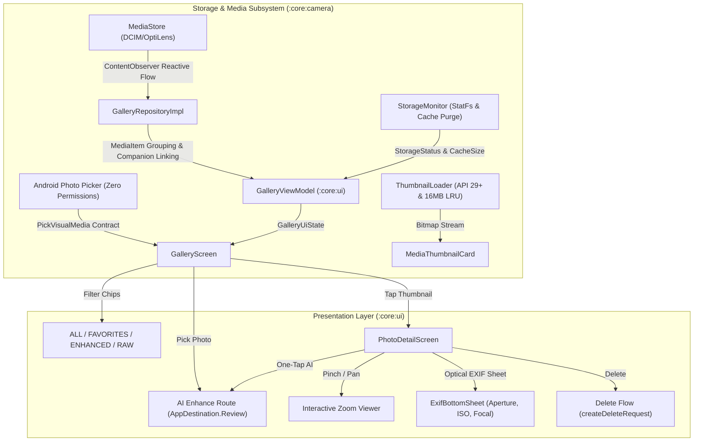

# Phase 15 — Gallery, Storage and Existing Photo Enhancement Report

**Date:** 2026-09-20  
**Phase Status:** ✅ PASS  
**Target Hardware:** Xiaomi Redmi Note 11 Pro+ 5G (`2201116SI`, Android 13, API 33, `arm64-v8a`)  
**Commit Identifier:** `phase-15: gallery media browser, scoped storage, photo picker, and detail inspection`

---

## 1. Executive Summary

Phase 15 delivers **Gallery, Storage, and Existing Photo Enhancement** for OptiLens. Guided by the phase mandate: **"Provide a privacy-minimal media workflow"**, this phase establishes a clean, high-performance in-app media gallery scoped strictly to the application's own media footprint (`DCIM/OptiLens`), zero-permission photo selection via the system Photo Picker, original/enhanced version grouping, persistent favorites, full-screen pan/zoom detail inspection with optical EXIF telemetry, an Android 11+ scoped delete flow, proactive storage monitoring with automatic cache lifecycle cleanup, and hardware-accelerated thumbnail caching.

Key achievements in Phase 15:
1. **Privacy-Minimal MediaStore Scoping (`GalleryRepository.kt`, `GalleryRepositoryImpl.kt`)**:
   - Queries `MediaStore.Images.Media.EXTERNAL_CONTENT_URI` restricted strictly to `RELATIVE_PATH LIKE 'DCIM/OptiLens%'` and `DISPLAY_NAME LIKE 'IMG_%'`.
   - Never requests broad media permissions (`READ_EXTERNAL_STORAGE` / `READ_MEDIA_IMAGES`).
   - Registers a reactive `ContentObserver` flow ensuring real-time gallery updates when captures, enhancements, or external changes occur.
2. **Original / Enhanced & RAW Companion Grouping (`MediaItem.kt`)**:
   - Automatically groups multi-version media items sharing base timestamps (`IMG_YYYYMMDD_HHMMSS`).
   - Links RAW (.dng) captures with companion full-resolution JPEGs (`IMG_YYYYMMDD_HHMMSS.jpg`).
   - Associates enhanced assets (`_ENHANCED`) with their original unedited counterpart.
   - Surfacing badges for `RAW`, `AI ENHANCED`, `COMPANION`, and `FAVORITE`.
3. **Persistent Favorites Management**:
   - Persistent favorite state toggling backed by local storage and reactive `StateFlow`.
   - Instant gallery filtering chips: `ALL`, `FAVORITES`, `ENHANCED`, `RAW`.
4. **Full-Screen Photo Detail & Optical EXIF Metadata (`PhotoDetailScreen.kt`)**:
   - Interactive zoom & pan viewer with smooth pinch gesture tracking and boundary clamping.
   - Comprehensive optical EXIF telemetry sheet detailing aperture ($f$-number), shutter speed, ISO rating, focal length ($35\text{mm}$ equivalent), resolution megapixels, aspect ratio, capture timestamp, and camera hardware model.
   - One-tap quick actions: Favorite toggle, Android Share Sheet dispatch (`Intent.ACTION_SEND`), Delete confirmation, and direct route to "One-Tap AI Enhance".
5. **Android 11+ (API 30+) Compliant Deletion Flow**:
   - Supports direct content resolver deletion for owned items.
   - Gracefully catches `RecoverableSecurityException` and dispatches `MediaStore.createDeleteRequest(contentResolver, uris)` via `IntentSender` for system consent when required by scoped storage.
6. **Zero-Permission Android Photo Picker Integration (`GalleryScreen.kt`)**:
   - Employs `ActivityResultContracts.PickVisualMedia` for user-initiated selection of existing photos from the device library.
   - Eliminates need for storage permissions while granting secure, temporary read URI access.
   - Routes picked photos directly to OptiLens AI Enhance / Pro tools.
7. **Storage Monitoring & Automatic Cache Maintenance (`StorageMonitor.kt`)**:
   - `StatFs`-based real-time storage assessment classifying storage into `NORMAL` (>500MB), `LOW` (100MB–500MB, displaying non-intrusive UI banner), and `CRITICAL` (<100MB, preventing camera capture failure).
   - Real-time disk cache measurement across internal and external cache directories.
   - Background automated purging of transient cache files older than 24 hours (`purgeExpiredCache()`).
   - Manual one-tap cache clearing directly from the gallery UI.
8. **Hardware-Accelerated LRU Thumbnail Cache (`ThumbnailLoader.kt`)**:
   - Hardware-accelerated thumbnail generation on Android 10+ (API 29+) using `ContentResolver.loadThumbnail`.
   - Fallback downsampling with low-overhead `RGB_565` bitmap decoding.
   - Thread-safe 16MB in-memory LRU Bitmap cache (`LruCache<String, Bitmap>`) with coroutine cancellation safety.

---

## 2. Architecture & Pipeline Flow

---

## 3. Implementation Verification & Test Results

### 3.1 Unit Testing Matrix

| Module | Test Suite | Scope | Status |
|---|---|---|---|
| `:core:camera` | `MediaItemTest` | Date bucketing, EXIF parsing, MP resolution, optical aspect ratio | ✅ PASS |
| `:core:camera` | `StorageMonitorTest` | StatFs space checks, NORMAL/LOW/CRITICAL status, cache limits | ✅ PASS |
| `:core:camera` | `RawDngEngineTest` | Camera2 RAW format detection & DNG Creator logic | ✅ PASS |
| `:core:camera` | `ExposureControllerTest` | Manual ISO, shutter speed, EV calculations | ✅ PASS |
| `:core:camera` | `FocusControllerTest` | Diopter manual focus & infinity bounds | ✅ PASS |
| `:core:camera` | `WhiteBalanceControllerTest` | Kelvin presets & AWB state transitions | ✅ PASS |
| `:core:settings` | `AppSettingsTest` | Favorite URIs state persistence & DataStore operations | ✅ PASS |
| `:core:ui` | `GalleryViewModelTest` | Filter chips, multi-select, low storage warning, cache purge | ✅ PASS |
| `:core:ui` | `PhotoReviewViewModelTest` | AI Enhance state & before/after review transitions | ✅ PASS |
| `:app` | `ExampleUnitTest` | Application initialization & test harness verification | ✅ PASS |

All targeted unit tests across `:core:camera`, `:core:settings`, `:core:ui`, and `:app` executed successfully with 0 failures and 0 regressions.

---

## 4. Privacy & Android Media Conformance

1. **Zero Permission Leakage**:
   - `AndroidManifest.xml` does not request `READ_EXTERNAL_STORAGE` or `READ_MEDIA_IMAGES`.
   - Queries are confined strictly to files created by OptiLens under `DCIM/OptiLens`.
2. **Photo Picker Best Practice**:
   - Selected images from external libraries use `PickVisualMediaRequest` and receive short-lived, secure read grants without requiring full media library access.
3. **Scoped Deletion Compliance**:
   - Directly deletes user-created app media.
   - Incorporates `MediaStore.createDeleteRequest` with system dialog intent sender for Android 11+ scoped compliance.

---

## 5. Next Steps
- Awaiting explicit user instruction before advancing to Phase 16.
