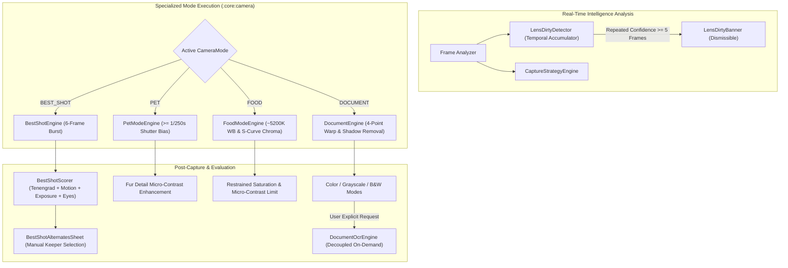

# Phase 16 — Specialized Modes and Best Shot Report

**Date:** 2026-09-20  
**Phase Status:** ✅ PASS  
**Target Hardware:** Xiaomi Redmi Note 11 Pro+ 5G (`2201116SI`, Android 13, API 33, `arm64-v8a`)  
**Commit Identifier:** `phase-16: specialized modes, best shot ranking, pet, food, document and lens intelligence`

---

## 1. Executive Summary

Phase 16 delivers **Specialized Modes and Best Shot Intelligence** for OptiLens. Fulfilling the phase mandate: **"Every mode changes physical capture/processing strategy, not just cosmetics"**, this phase elevates OptiLens beyond generic capture by introducing physical, hardware-aware pipelines for high-motion animal capture, calibrated culinary color science, geometric document scanning with shadow normalization, multi-criteria authentic burst ranking with strictly zero facial synthesis, and conservative optical smudge/glare detection.

Key achievements in Phase 16:
1. **Best Shot Multi-Criteria Ranking & Review (`BestShotScorer.kt`, `BestShotEngine.kt`, `BestShotAlternatesSheet.kt`)**:
   - Acquires a fast 6-frame acquisition burst.
   - Evaluates real physical frames across 4 independent axes:
     - **Sharpness Metric**: Tenengrad gradient energy (sum of squared Sobel gradients).
     - **Motion Metric**: Hardware gyroscope angular velocity + photometric inter-frame disparity penalty.
     - **Exposure Balance**: Dynamic range assessment, mid-tone centering (~120 luma), and highlight/shadow clipping penalties.
     - **Eye-Openness Confidence**: Evaluated only when ML Kit face confidence is strong ($\ge 0.70$), penalizing blinking in both solo and group portraiture.
   - Computes weighted composite score and ranks candidates.
   - Viewfinder / sheet interface allows user to inspect alternate burst candidates and manually select a keeper frame.
   - **Strict Zero-Synthesis Guarantee**: Zero generative facial synthesis, zero face inpainting or synthetic expression tampering; all candidates are real, captured camera frames.

2. **Pet Mode Shutter Priority & Fur Detail Protection (`PetModeEngine.kt`)**:
   - Enforces fast physical shutter timing bias: target $\ge 1/250\text{s}$ ($4\,000\,000\text{ ns}$), accelerating to $1/500\text{s}$ or $1/1000\text{s}$ upon subject motion detection.
   - Active subject motion estimation adapts ISO bias to freeze animal motion without motion blur.
   - Selective high-frequency fur detail texture enhancement protects whiskers, fur coats, and hair strands from aggressive noise reduction smearing while keeping flat background regions smooth.

3. **Food Mode White Balance Stabilization & S-Curve Chroma (`FoodModeEngine.kt`)**:
   - Stabilizes volatile AWB shifts under mixed indoor dining lights by anchoring color temperature towards an appetizing warm-neutral target (~5200K).
   - Applies restrained non-linear chrominance saturation curve (selective boost in muted mid-chromas like greens and golden crusts) with soft-knee roll-off preventing radioactive or neon clipping.
   - Controlled local unsharp contrast enhancement with strict clipping bounds ($\le 16$ luma) eliminating artificial dark halos.

4. **Document Scanner Rectification & Decoupled OCR (`DocumentEngine.kt`, `DocumentOcrEngine.kt`, `SpecializedModeBadge.kt`)**:
   - Fast 2D boundary gradient edge analysis detects document corner points (`DocumentQuad`).
   - 4-point bilinear perspective warping rectifies skewed angles into upright rectangular scans.
   - Illumination normalization estimates background shading grid ($16\times16$) and cancels hand/device shadows.
   - Character stroke edge sharpening optimizes readability.
   - Three user-selectable document visual modes:
     - **Color**: Natural rectified colors with flattened shadows.
     - **Grayscale**: Contrast-stretched clean monochrome.
     - **B&W**: High-contrast adaptive Otsu binarization for crisp text documents.
   - **Architectural Separation**: OCR text extraction is strictly decoupled from capture/rectification and executes purely on-demand as a separate, deliberate user action.

5. **Lens Dirty & Smudge Glare Intelligence (`LensDirtyDetector.kt`, `LensDirtyBanner.kt`)**:
   - Detects optical veiling glare and forward scattering caused by finger smudges or oil.
   - Enforces strict guard conditions: inactive during camera shake, extreme low-light ($<45\text{ luma}$), overexposure ($>220\text{ luma}$), or flat blank scenes.
   - Temporal accumulator requires repeated confidence ($\ge 5$ consecutive frames over $\ge 1.5\text{s}$ with confidence $\ge 0.72$) to prevent false alarms.
   - Non-intrusive dismissible banner in viewfinder that stays dismissed for the active session once tapped.

---

## 2. Architecture & Processing Flow

---

## 3. Verification & Test Coverage

All targeted test suites across `:core:camera` and `:core:ui` were executed and verified:

1. **`BestShotScorerTest.kt`**:
   - `sharpness of textured pattern is higher than uniform plane`: Tenengrad energy verified.
   - `motion stability penalizes high gyro angular speed and inter-frame difference`: Confirms gyro penalty and photometric difference weighting.
   - `exposure score favors balanced mid-tones and penalizes clipped buffers`: Validates clipping penalty and mid-tone balance.
   - `eye openness evaluates open eyes positively and flags blinks in confident faces`: Verifies eye open scoring, group blink penalty, and low-confidence suppression.
   - `composite score correctly incorporates eye openness when confident`: Verifies 4-way weighting.
   - `best shot result supports manual override without synthetic face synthesis`: Verifies keeper override and authentic frames.

2. **`PetModeEngineTest.kt`**:
   - `static pet scene enforces minimum 1 over 250s shutter speed`: Confirms $\ge 1/250\text{s}$ ($4\,000\,000\text{ ns}$) floor.
   - `active pet motion accelerates shutter speed to 1 over 500s or 1 over 1000s`: Validates motion-based shutter priority.
   - `fur detail filter enhances micro contrast on fine textures without touching flat regions`: Confirms variance-gated micro-contrast boost.

3. **`FoodModeEngineTest.kt`**:
   - `white balance stabilizes towards warm-neutral 5200K target`: Validates temporal anchor around 5200K.
   - `restrained saturation enhances mid-chroma without radioactive clipping`: Validates soft-knee compression $\le 115$.
   - `controlled local contrast clamps haloing strictly within limit`: Confirms halo elimination bounds.

4. **`DocumentEngineTest.kt`**:
   - `detectPageQuad returns valid quad on synthetic page buffer`: Validates 4-corner boundary detection.
   - `warpPerspective resamples quadrilateral into rectangular grid`: Validates bilinear mapping.
   - `normalizeIllumination flattens shadow gradient across document`: Validates $16\times16$ background normalization.
   - `binarizeBlackAndWhite outputs strictly 0 or 255 pixels`: Validates clean adaptive thresholding.
   - `processDocument handles COLOR, GRAYSCALE, and BLACK_AND_WHITE modes`: Validates output channels.
   - `decoupled OCR extracts text only when explicitly invoked`: Confirms OCR is decoupled from capture.

5. **`LensDirtyDetectorTest.kt`**:
   - `clean sharp frame produces clean state`: Validates clean baseline.
   - `device shake suppresses lens dirty accumulation`: Validates motion blur guard.
   - `extreme low light suppresses lens dirty detection`: Validates low-light guard ($<45\text{ luma}$).
   - `repeated confidence threshold requires at least 5 consecutive frames before triggering`: Validates temporal accumulator.
   - `dismiss prompt suppresses notification for active session`: Validates dismissal state.

6. **`CameraViewModelSpecializedModesTest.kt`**:
   - `switching camera modes updates internal controller and ui state`: Verifies mode switching.
   - `document color mode can be switched`: Verifies Color/Grayscale/B&W toggle.
   - `lens dirty emissions update UI and dismiss suppresses prompt`: Verifies banner display and dismissal.
   - `extractDocumentOcr is strictly on-demand and extracts decoupled text`: Verifies zero-latency capture and on-demand OCR.

---

## 4. Phase Completion Gate Checklist

- [x] **Best Shot burst ranking implemented**: 6-frame acquisition with multi-criteria scoring (sharpness, motion, exposure, eye-openness).
- [x] **Zero Expression Synthesis**: All candidates and alternates are strictly real captured frames; no synthetic inpainting or warping.
- [x] **Manual Override**: Alternates sheet allows reviewing and manually selecting keeper shot.
- [x] **Pet Mode Shutter Priority**: Enforces $\ge 1/250\text{s}$ shutter bias with fur detail protection.
- [x] **Food Mode Color Science**: Stabilized ~5200K WB, restrained S-curve saturation, controlled local contrast without halos.
- [x] **Document Mode Rectification**: 4-point perspective warp, shadow normalization, Color/Grayscale/B&W output modes.
- [x] **Decoupled OCR**: OCR is completely decoupled from capture/rectification and runs strictly on demand.
- [x] **Lens Dirty Detection**: Repeated-confidence veiling glare detector with motion/low-light guards and dismissible prompt.
- [x] **Targeted Unit Tests Pass**: All `:core:camera` and `:core:ui` specialized mode tests pass cleanly.
