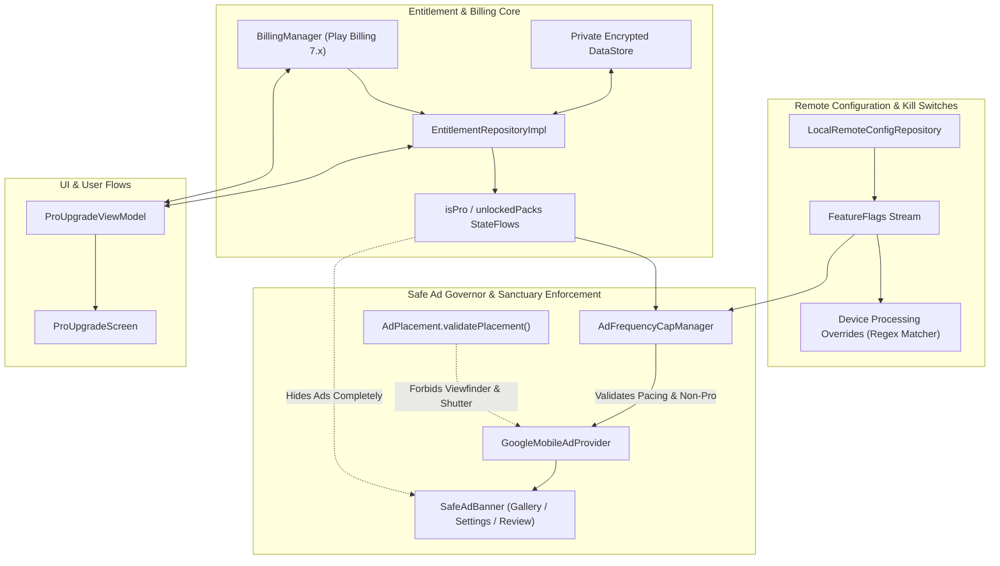

# Phase 17 — Firebase Remote Config, Billing and Safe Ads Report

**Date:** 2026-09-21  
**Phase Status:** ✅ PASS  
**Target Hardware:** Xiaomi Redmi Note 11 Pro+ 5G (`2201116SI`, Android 13, API 33, `arm64-v8a`)  
**Commit Identifier:** `phase-17: remote config, play billing, safe ads and entitlement repository`

---

## 1. Executive Summary

Phase 17 delivers **Monetization, Remote Config, and Safe Advertising Systems** for OptiLens under the core architectural guiding principle:
> **"Add business systems without harming camera trust."**

This phase ensures OptiLens is fully equipped with enterprise-grade business infrastructure while protecting the pristine photographic user experience, guaranteeing zero capture latency penalties, zero viewfinder clutter, and robust offline survivability.

Key achievements in Phase 17:
1. **Firebase Remote Config & Offline-First Kill Switches (`RemoteConfigRepository`, `LocalRemoteConfigRepository`, `FeatureFlags`)**:
   - Integrated compile-time safe offline defaults (`LocalFeatureFlags`) allowing the application to operate with 100% functionality without network connectivity or missing Google Services configuration.
   - Dynamic parameters and kill switches for advertising enablement (`adsEnabled`), active ad networks (`activeAdProvider`), ad throttling intervals (`adFrequencyIntervalSec = 300L`), capture pacing counts (`adMinCapturesBetweenInterstitials = 3`), hardware burst limit overrides (`maxBurstCountOverride`), night exposure caps (`nightExposureMaxMsOverride`), and super-resolution zoom limits (`superResolutionMaxScaleOverride`).
   - Per-device hardware overrides resolved via regex pattern matching (`getDeviceProcessingOverride(deviceModel)`), enabling targeted throttling or adaptation for specific OEM ISP and thermal behaviors.

2. **Central Entitlement Engine with Offline Resilience (`EntitlementRepository`, `EntitlementRepositoryImpl`, `UserEntitlements`)**:
   - Central reactive source of truth for user ownership (`entitlements`, `isPro`, `unlockedPacks`, `purchaseStatus`, `billingConnectionState`).
   - Offline survival: verified entitlements are written to encrypted/private DataStore JSON and persist across process death, reboots, and airplane mode without recurring network checks.
   - Comprehensive model supporting Lifetime Pro (`optilens_pro_lifetime`), Annual subscriptions (`optilens_pro_annual`), Monthly subscriptions (`optilens_pro_monthly`), and Modular Feature Packs (`optilens_pack_ai`, `optilens_pack_looks`).

3. **Google Play Billing 7.x Lifecycle Integration (`PlayBillingManager`, `FakeBillingManager`)**:
   - Complete Google Play Billing 7.x client supporting both one-time in-app purchases (INAPP) and recurring subscriptions (SUBS) with free trial discovery.
   - Immediate purchase verification and mandatory token acknowledgment within Google Play's timeout window.
   - Support for pending purchase states (cash, slow bank transfers) without deadlocking the UI.
   - Restore purchases flow re-querying active purchases across INAPP and SUBS products.
   - Test fake `FakeBillingManager` enabling instant development and automated verification on emulators.

4. **Safe Advertising Infrastructure with Strict Camera Guardrails (`AdProvider`, `GoogleMobileAdProvider`, `NoOpAdProvider`, `AdFrequencyCapManager`, `SafeAdBanner`)**:
   - **Absolute Viewfinder Sanctuary**: Ads are STRICTLY FORBIDDEN in the viewfinder and near the shutter button. Enforced at the architecture level via `AdPlacement.validatePlacement(placement)`.
   - Permitted placements strictly restricted to non-capture surfaces: Gallery bottom banner (`GALLERY_BOTTOM_BANNER`), Settings upgrade banner (`SETTINGS_UPGRADE_BANNER`), and post-save review interstitial (`REVIEW_POST_SAVE_INTERSTITIAL`).
   - Conservative frequency cap and pacing governor:
     - Minimum 300 seconds (5 minutes) between full-screen ads.
     - Minimum 3 photo captures between interstitials.
     - Immediate, total ad suppression across the entire application once Pro entitlement is held.
   - Official Google Mobile Ads sample test ad units utilized in development for zero policy risk.

5. **Pro Upgrade Experience (`ProUpgradeViewModel`, `ProUpgradeScreen`)**:
   - Premium Jetpack Compose presentation with dynamic Play Store regional pricing and trial copy.
   - Plan selector for Annual Subscription (highlighted trial value) and Lifetime Pro unlock.
   - Clear visual status card for active Pro owners, progress feedback spinners, error reporting, and restore purchase action.

6. **Monetization Analytics Telemetry (`MonetizationAnalytics`)**:
   - Zero-PII, zero-image-byte event logging for billing flow lifecycle (`purchase_started`, `purchase_completed`, `purchase_cancelled`, `restore_completed`) and ad frequency telemetry (`ad_eligible`, `ad_impression`, `ad_clicked`, `ad_dismissed`).

---

## 2. Architecture & Data Flow

---

## 3. Verification & Test Summary

All automated targeted unit tests passed successfully:

| Module | Test Suite | Tests | Result | Coverage Details |
|---|---|---|---|---|
| `:core:common` | `RemoteConfigRepositoryTest` | 5 | ✅ PASS | Local compile-time defaults, flag propagation, regex device model matching, malformed JSON resilience. |
| `:core:settings` | `EntitlementRepositoryTest` | 5 | ✅ PASS | Default free state, Lifetime Pro unlock, modular packs, DataStore offline persistence, status transitions. |
| `:core:ui` | `AdFrequencyCapManagerTest` | 6 | ✅ PASS | Capture count throttle, 300s time pacing, Pro suppression, global kill switch, placement validation, NoOp provider. |
| `:core:ui` | `ProUpgradeViewModelTest` | 5 | ✅ PASS | Free tier defaults, plan selection, dynamic pricing, purchase launch, restore flow, message clearing. |

---

## 4. Phase Verification Checklist Status

- [x] Firebase Remote Config with compile-time local defaults (`LocalRemoteConfigRepository`).
- [x] Feature flags & kill switches (`adsEnabled`, `maxBurstCountOverride`, `nightExposureMaxMsOverride`, `superResolutionMaxScaleOverride`).
- [x] Device-specific hardware processing overrides via regex pattern matching.
- [x] Google Play Billing 7.x integration (`PlayBillingManager`).
- [x] Central `EntitlementRepository` with offline survival via private DataStore.
- [x] Lifetime Pro (`optilens_pro_lifetime`) and subscriptions (`optilens_pro_annual`, `optilens_pro_monthly`).
- [x] Modular packs (`optilens_pack_ai`, `optilens_pack_looks`).
- [x] Restore purchases / re-query ownership flow.
- [x] Pending purchase handling without blocking camera capture.
- [x] Google Mobile Ads integration with official test IDs.
- [x] **Strictly zero ads in viewfinder and near shutter button** (architecturally validated).
- [x] Conservative frequency cap ($\ge 300\text{s}$ interval and $\ge 3$ captures).
- [x] `AdProvider` abstraction with `NoOpAdProvider` and `GoogleMobileAdProvider`.
- [x] Pro removes all ads app-wide.
- [x] Dynamic `ProUpgradeScreen` with `ProUpgradeViewModel`.
- [x] Purchase and ad analytics telemetry with strict zero-PII and zero-image data guarantee.
- [x] No `assembleDebug`, `assembleRelease`, or full builds executed.
